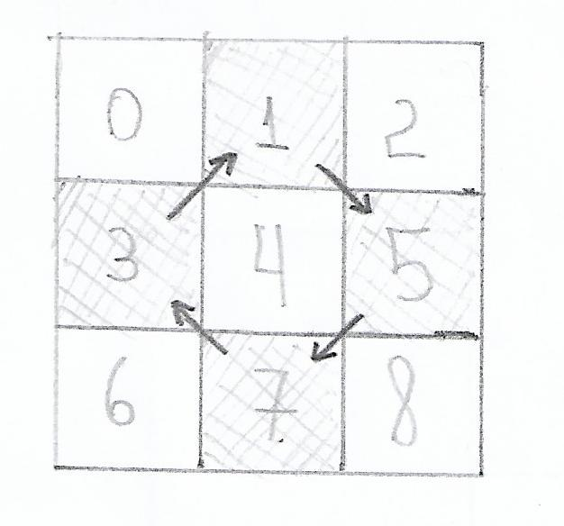
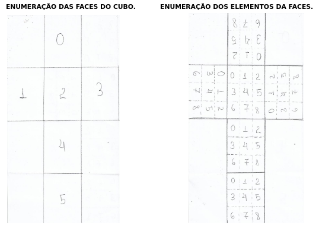
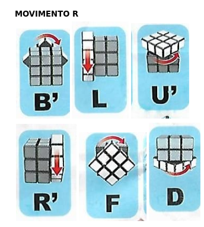
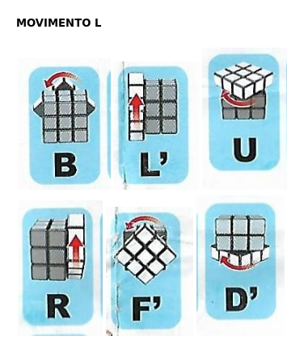
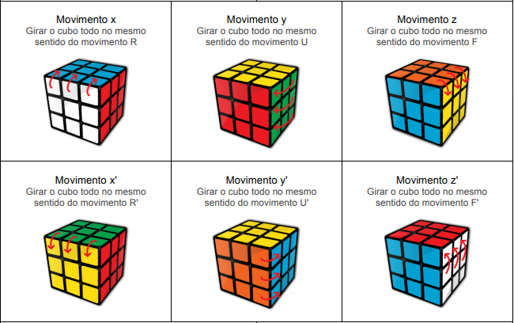
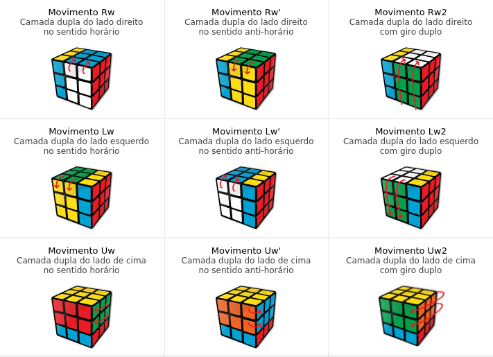
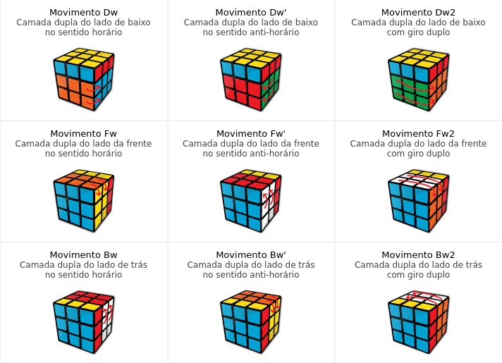
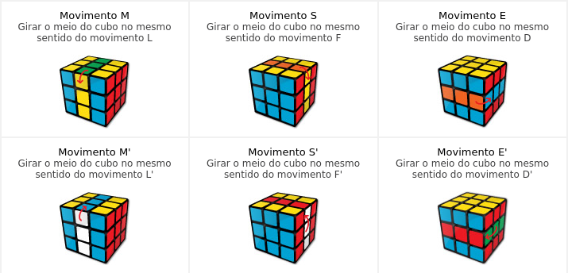

# IA 

Aqui encontramos os códigos referentes a Inteligência Artificial. Podemos encontrar os seguintes pacotes:

## IA
Nesta pasta encontramos as seguintes classes principais:

### CasosEspeciais

Este código resolve o cubo mágico apenas para casos clássicos, tais como o Xadrez, Zig-Zag e dos Meios.

### Fridrich

Está classe contêm a implementação do algoritmo de Fridrich com os casos F2L, OLL e PLL. A explicação do algoritmo pode ser encontrado no link a seguir: http://www.cubovelocidade.com.br/tutoriais/cubo-magico-avancado-apostila-metodo-fridrich.pdf 

Os métodos a seguir estam presentes nessa classe:

```java
private void F2L() ;
```

- Apresenta os casos F2L.

```java
private void OLL();
```

- Apresenta os casos OLL.

```java
private void PLL();
```

- Apresenta os casos PLL.

```java
public void caseF2L();
```

- Chamada pública dos casos F2L.

```java
public void caseOLL();
```

- Chamada pública dos casos OLL.

```java
public void casePLL();
```
- Chamada pública dos casos PLL.

```java
private void performsMovements(String inputs);
```

- Realiza os movimentos em cada caso.

### IABasic

Podemos definir este arquivo como o Main, nele foi escrito a implementação do algoritmo da Cruz Branca e é onde ocorre toda manipulação inicial do Cubo, desde a captura das faces até o envio dos movimentos para um arquivo .txt.

Aqui é encotrado os seguintes métodos:

```java
private static int elementoAdjacente(int posElemento, Movimento f);
```

- Retorna o elemento(cubinho) Adjacente do elemento informado.

```java
private static int FaceAdjacente(int posElemento);
```
- Retorna a Face Adjacente do elemento(cubinho) informado.

```java
private static void alinhamento(Movimento f);
```

- Alinha os cantos brancos. Cubinho Branco-Azul fica debaixo da face Azul; Cubinho Branco-Laranja fica debaixo da face Laranja; Cubinho Branco-Vermelho fica debaixo da face Vermelha; Cubinho Branco-Verde fica debaixo da face Verde.

```java
private static int prox(int pos);
```

**_Posição dos elementos da Face_**

- A primeira etapa da Cruz Branca é colocar no lugar as peças das posições 1, 5, 7 e 3. Após colocar a peça no lugar o computador precisa saber qual será a próxima para não se perder na resolução. Informando a posição do atual elemento que acabou de ser colocado no lugar, este método retorna a posição do próximo canto para ser colocado o próximo elemento. 

## move
Nesta pasta encontramos apenas uma classe chamada Movimento. Aqui é gerado o emulador do Cubo, apresentando o seu desenho através de um array bi-dimensional, analogo as seguintes imagens:



Está classe contêm os seguintes métodos para a manipulação do objeto:

```java
public Movimento(int[][] lista);
```
- Método construtor da classe, recebe um array bi-dimensional do tipo inteiro que descreve o Cubo.

```java
public void print();
```
- Mostra no terminal a imagem que o cubo apresenta no presente momento.

```java
public void spinRightFront(int face);
```
- Realiza os seguintes giros:




```java
public void spinLeftBack(int face);
```
- Realiza os seguintes giros:



_**OBS: Neste projeto a String que representa o movimento segue a seguinte estrutura: FACE + SENTIDO_DO_MOVIMENTO. 'FACE' pode assumir como valor os elementos pertencentes ao conjunto {0,1,2,3,4,5}. 'SENTIDO_DO_MOVIMENTO' tem como valor R e L para movimentos realizados pelos respectivos métodos _spinRightFront(int face);_ e _spinLeftBack(int face);_ citados anteriormente.**_

```java
public ArrayList<String> getMove();
```
- Retorna um ArrayList do tipo String apresentando todos os movimentos apresentados desde o início até o fim dos movimentos.

```java
public String indexof(int cubinho , int adjacente);
```

- Retorna uma String com um texto informando a posição de algum cubinho que está presente em algum dos cantos do Cubo.

```java
public String indexof(int cubinho, int adjacente_cima, int adjacente_ao_lado);
```

- Retorna uma String com um texto informando a posição de algum cubinho que está presente em alguma das quinas do Cubo.

```java
public String getPos(int face, int posicao);
```

- Retorna uma String com um texto informando a cor do cubinho que está em determinada face e posição.

```java
public void finishMove();
```

- Deve ser chamado após o último movimento, pois indica que não há mais nenhum movimento para ser feito.

```java
public void moveAxisXPositive();
```

- Gira o cubo no eixo X positivo.

```java
public void moveAxisXNegative();
```

- Gira o cubo no eixo X negativo. 

```java
public void moveAxisYPositive();
```

- Gira o cubo no eixo Y positivo. 

```java
public void moveAxisYNegative();
```

- Gira o cubo no eixo Y negativo. 

```java
public void moveAxisZPositive();
```

- Gira o cubo no eixo Z positivo. 

```java
public void moveAxisZNegative();
```

- Gira o cubo no eixo Z negativo. 



**_A imagem corresponde aos movimentos analogos aos seis últimos métodos. Vale observar que a notação destes métodos são iguais em linguagem de computador e de resolução do cubo mágico._**

```java
public void moveRw();
```

- Realiza o movimento Rw.

```java
public void moveRwNegative();
```

- Realiza o movimento Rw'.

```java
public void moveRw2();
```

- Realiza o movimento Rw2.

```java
public void moveLw();
```

- Realiza o movimento Lw.

```java
public void moveLwNegative();
```

- Realiza o movimento Lw'.

```java
public void moveLw2();
```

- Realiza o movimento Lw2.

```java
public void moveUw();
```

- Realiza o movimento Uw.

```java
public void moveUwNegative();
```

- Realiza o movimento Uw'.

```java
public void moveUw2();
```

- Realiza o movimento Uw2.



```java
public void moveDw();
```

- Realiza o movimento Dw.

```java
public void moveDwNegative();
```

- Realiza o movimento Dw'.

```java
public void moveDw2();
```

- Realiza o movimento Dw2.

```java
public void moveFw();
```

- Realiza o movimento Fw.
```java
public void moveFwNegative();
```

- Realiza o movimento Fw'.

```java
public void moveFw2();
```

- Realiza o movimento Fw2.

```java
public void moveBw();
```

- Realiza o movimento Bw.

```java
public void moveBwNegative();
```

- Realiza o movimento Bw'.

```java
public void moveBw2();
```

- Realiza o movimento Bw2.



```java
public void moveM();
```

- Realiza o movimento M.

```java
public void moveMNegative();
```

- Realiza o movimento M'.

```java
public void moveS();
```

- Realiza o movimento S.

```java
public void moveSNegative();
```

- Realiza o movimento S'.

```java
public void moveE();
```

- Realiza o movimento E.

```java
public void moveENegative();
```

- Realiza o movimento E'.



**_As três últimas imagens correspondem aos movimentos compostos. Esses movimentos são resultados da combinação dos movimentos das faces com os de troca de eixos. Vale notar que não tem uma tradução direta para linguagem de computador._**

```java
private void ignoreMove();
```
- Remove os três últimos elementos da lista dos movimentos.

## language
Este pacote faz a tradução das notações do Cubo Rubik para a do projeto(computador). Contém a classe Translate e TranslateCompound e ambas  apresentam os seguintes métodos:

### Translate
```java
private String TranslateToComputer(String moving);
```
- Método que faz a tradução da notação do Cubo mágico para a notação deste projeto.
```java
private String TranslateToCube(String moving);
```
- Método que faz a tradução da notação do computador para a notação do Cubo mágico.
```java
private void putElementInAListToComputer(String moving);
```
- Põe o elemento traduzido da notação do Cubo mágico para a notação do computador em uma lista. 
```java
private void putElementInAListToCube(String moving);
```
- Põe o elemento traduzido da notação do computador para a notação do Cubo mágico em uma lista.
```java
public String getTranslationToComputer(String moving);
```
- Captura a tradução do elemento atual para a linguagem do computador. 
```java
public String getTranslationToCube(String moving);
```
- Captura a tradução do elemento atual para a linguagem do Cubo mágico. 
```java
public ArrayList<String> getTranslationToComputer(ArrayList<String> moving);
```
- Captura a tradução de um ArrayList para a linguagem do computador. 
```java
public ArrayList<String> getTranslationToCube(ArrayList<String> moving);
```
- Captura a tradução de um ArrayList para a linguagem do Cubo mágico.  
```java
public ArrayList<String> getMoveToComputer();
```
- Captura todos os movimentos na notação do computador.
```java
public ArrayList<String> getMoveToCube();
```
- Captura todos os movimentos na notação do Cubo mágico.

### TranslateCompound
É importante lembrar que este arquivo é válido apenas para os movimentos compostos e movimentos de troca de eixos e não contêm uma tradução para a linguagem de máquina. Então o único método de manipulação nesta classe é passado como argumento o movimento e é aplicado diretamente o movimento no Cubo Mágico emulado.

```java
public void cases(String input);
```

## communication
Nesta pasta está contido a classe Writer que apresenta um único método estático chamado writer que recebe como argumentos um ArrayList correspondente aos movimentos realizados e envia os movimentos para um arquivo .txt
```java
public static void writer(ArrayList<String> moves);
```

## user
Nesta pasta encontramos o programa Emulador, que tem como objetivo demonstrar para o usuário o funcionamento do emulador do Cubo Mágico.

Para executar o programa entre nessa pasta pelo terminal e execute o seguinte comando:

```sh
$ ./emulator.sh
```

## test
Apresenta apenas arquivos de testes.

## cam
Apresenta arquivos para captura das faces através de uma câmera(Obs.: Ainda não finalizado).