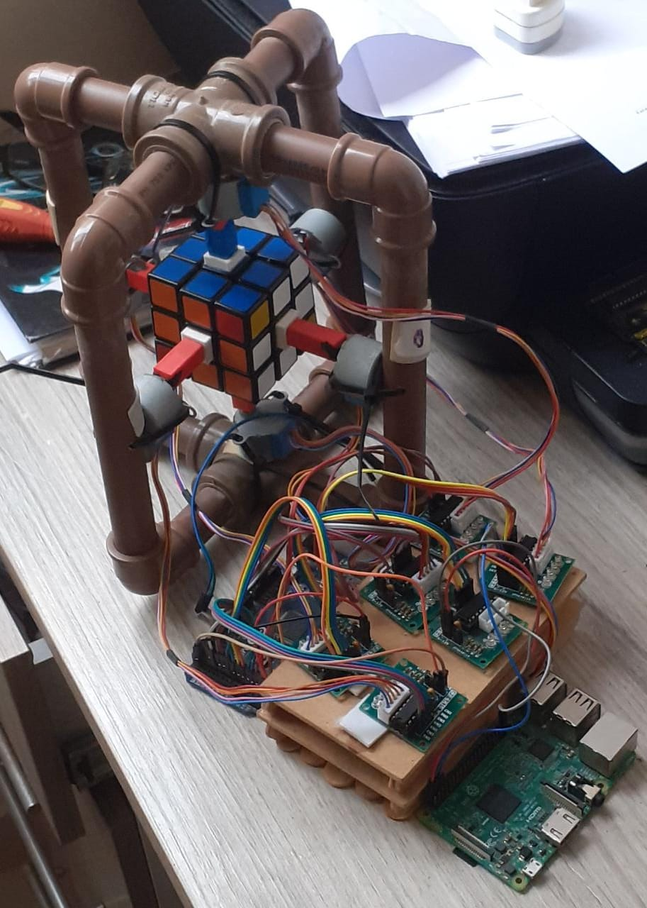

# Robot_Rubiks
Robô que resolve o cubo mágico. Este projeto foi desenvolvido para a P.D. Física e Tecnologia do 9º ensino fundamental do ano de 2018. No ano de 2020 pretendo dar seguimento no projeto, apenas para aprimorá-lo, assim fazendo uma nova versão.

## Robô

## I.A.

A inteligência artificial e o emulador do cubo para a realização dos movimentos e testes foi escrito em Java. 

### Input

O Input do código no momento está sendo feito pelo terminal, entretando será implementado uma webcam para capturar as cores da face do cubo, para a realização desse feito utilizarei a biblioteca de visão computacional OpenCV(A implentação deste código está na pasta 'Input').

#### Faces

|Número|   Cor  | 
|------|--------|
|  0   |Amarelo |
|  1   |Laranja |
|  2   |  Azul  |
|  3   |Vermelho| 
|  4   | Branco |
|  5   | Verde  |

### Algoritmo

Primeiro montamos a Cruz branca e depois é aplicado o algoritmo de Fridrich. Em seguida enviamos os movimentos para um arquivo .txt. O código dessa parte pode ser encontrado na pasta 'IA'.

### Emulador

O emulador é feito por um array bi-dimensional e a permutação dos seus elementos é analoga a movimentação das faces do cubo. 

## Comunicação

Após o envio dos movimentos por um arquivo .txt um arquivo escrito em Python faz a leitura dos movimentos e estabelece uma comunicação Serial com o Arduino. Este arquivo pode ser encontrado na pasta 'Ponte'.

## Comandos da movimentação

O Arduino após a leitura envia o comando de giro para o respectivo motor de passo indicando o sentido de rotação. Este arquivo pode ser encontrado na pasta 'Master4'.

## Circuito elétrico

O circuito é bem simples, sendo composto apenas por seis motores de passo. Cada motor é atuado pelo drive ULN2003 e recebe o comando de um Arduino Mega 2560. Para implentar a webcam, será colocado um Raspberry Pi 3.

## Estrutura

### A estrutura do robô é composta pela seguinte lista:

- 1,80 metro de cano PVC de 20mm.
- (x8) Joelhos de 20mm.
- (x2) Cruz de 25mm.
- (x8) Redutores de cano 25mm - 20mm.
- (x12) Abraçadeiras de Nylon.
- (x6) Blocos retangulares impressos em impressora 3D de 2,5 cm X 1  cm X 1 cm. 

### O Cubo

O modelo do Cubo é o ShengShou Cube 3x3x3. No centro de cada face foi colado quadrados vazados de mesmo tamanho da peça central, assumindo o papel de transmissão do motor para o Cubo.